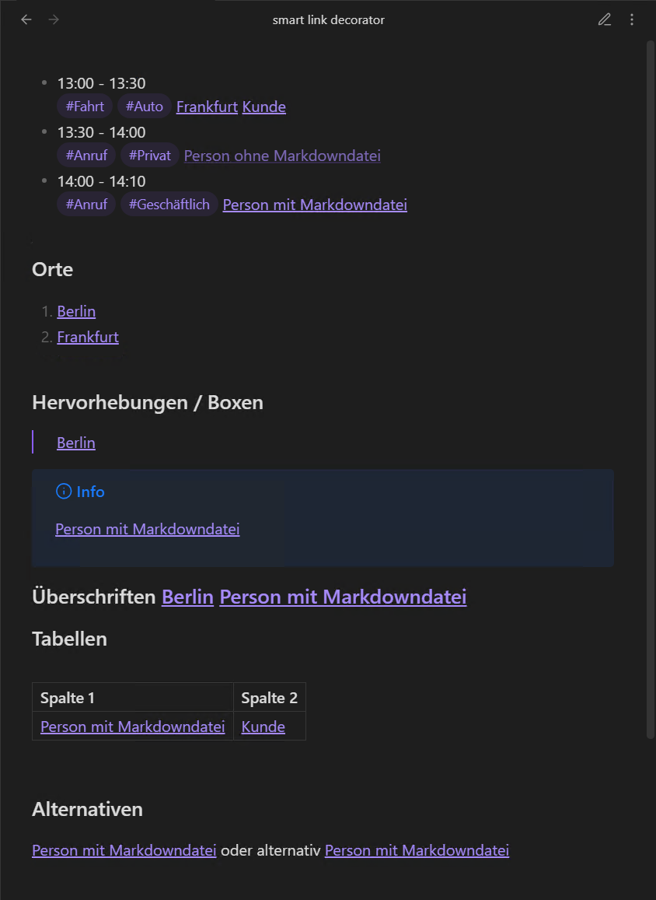
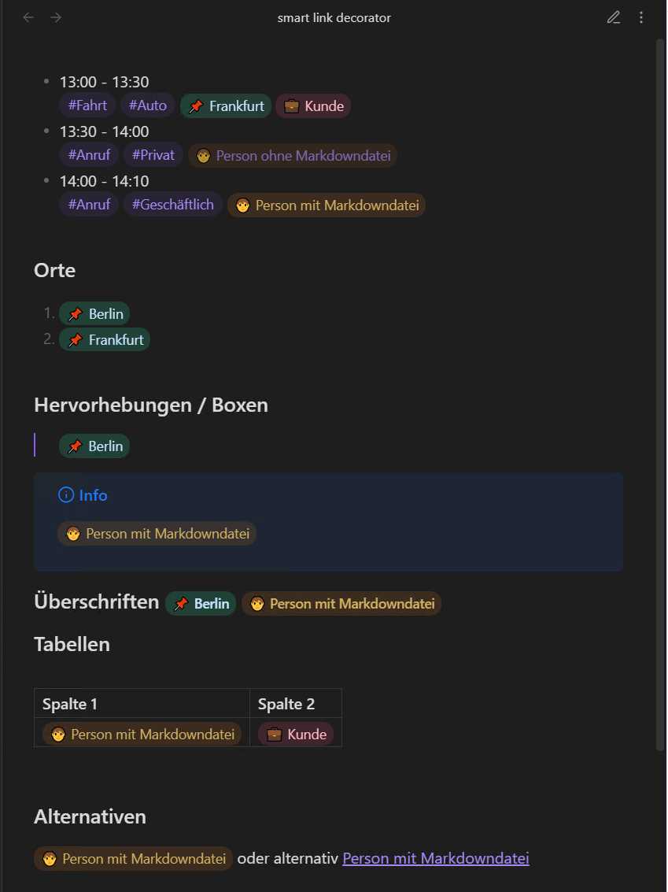
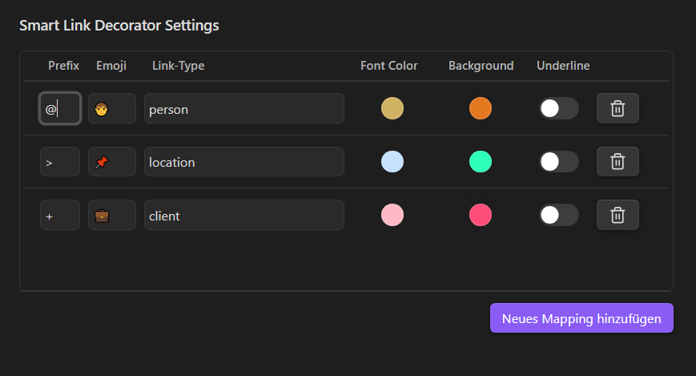

[BOTTOM](#dynamic-link-type-based-suggestion-lists) [CHANGELOG](CHANGELOG.md) [LICENSE](LICENSE) [ROADMAP](ROADMAP.md)

# Smart Link Decorator

The **Smart Link Decorator** plugin makes internal Obsidian links that use aliases more intelligent by automatically enriching them with relevant additional information.

- Smart Link Decorator extends internal Obsidian links with automatically generated supplementary information.
- Internal links are dynamically enriched, for example with metadata, status, or contextual information from the linked note.
- The visual presentation is configurable without modifying the actual link text.
- Links become more informative through enhanced visual styling, without duplicating content or requiring manual maintenance.
- The plugin improves orientation and readability in complex note networks.
- In addition, the plugin provides type-dependent selection lists that support the context-aware creation of internal links.

| Before                                                | After                                                |
|-------------------------------------------------------|------------------------------------------------------|
|  |  |

## Settings

The settings consist of an extendable list of configurations used to define and control how internal Obsidian links with aliases are handled.

Each entry represents a **link type** and defines both the behavior and visual appearance of links of that type.

---

**Prefix**  
A single typable character that triggers automatic replacement and opens context-aware selection lists.

When used at the beginning of an alias in an internal Obsidian link, the prefix determines the link type the link belongs to.

**Emoji**  
An emoji that automatically replaces the triggering prefix when the link is created.

**Link Type**  
A unique identifier with the following purposes:

- It is used to generate type-specific CSS classes dynamically.
- It is used to restrict internal link selection lists to notes that match this link type.

A note matches a link type if **either**:
- the identifier is present in the note’s frontmatter `tags`, or
- the note has a frontmatter property named `is[LinkType]` set to `true`.

**Font Color**  
The text color applied to internal Obsidian links of this link type.

**Background**  
A semi-transparent background color applied to internal Obsidian links of this link type.

**Underline**  
Specifies whether a text underline (`text-decoration`) is applied to internal Obsidian links of this link type.

**Delete**  
Removes this link type from the settings.

### Dynamic, Link-Type–Based Suggestion Lists

While editing a note, Smart Link Decorator enhances the creation of internal links by providing link-type–aware suggestion lists directly in the editor.

When typing `@<prefix><characters>`, the editor automatically opens a suggestion list that is filtered to notes matching the link type defined by `@<prefix>`. This makes it possible to create internal links quickly while ensuring that only contextually relevant notes are suggested.

A note appears in the suggestion list of one or more link types only, if it is explicitly associated with the corresponding link type in its frontmatter. This association can be defined in one of the following ways:

- by adding the link type identifier (including the trigger character) to the note’s frontmatter `tags`, or
- by defining a frontmatter property named `is[LinkType]` and setting it to `true`.

Notes that do not meet these conditions are excluded from the suggestion list, keeping link creation focused and reducing noise in the editor.

[TOP](#smart-link-decorator) [CHANGELOG](CHANGELOG.md) [LICENSE](LICENSE) [ROADMAP](ROADMAP.md)